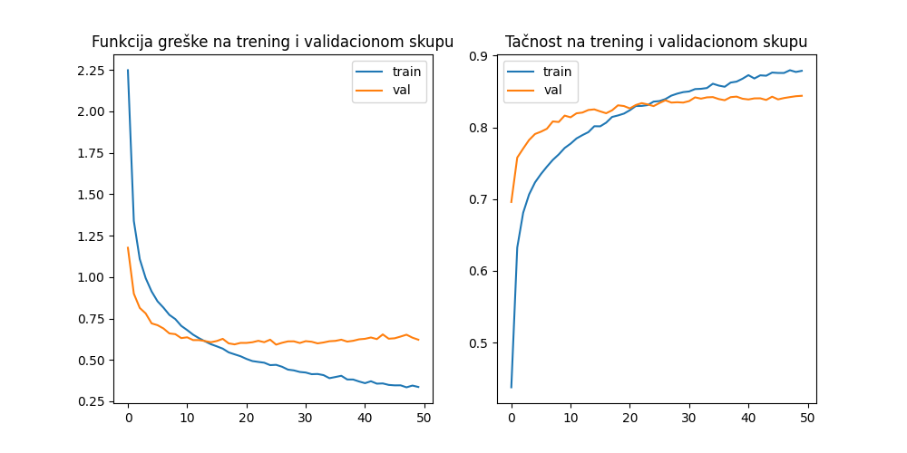
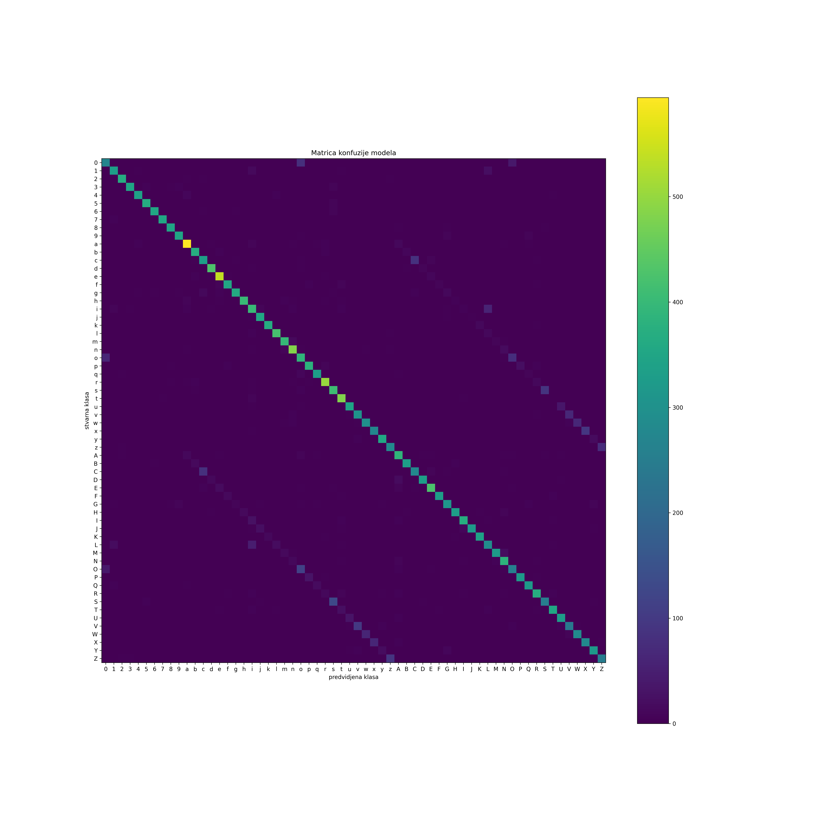

# **ML-2023**
Repozitorijum za studentski projekat iz kursa Mašinsko učenje.

## **Učesnici na projektu**
 - Bojan Bardžić (1072/2022)

## **Problem**
Potrebno je klasifikovati skup slika karaktera u svoje odgovarajuće klase.  
Karakteri mogu biti:
- mala slova iz engleske abecede **a-z**
- velika slova iz engleske abecede **A-Z**
- cifre **0-9**

Ukupno imamo **62** klase.

## **Skup podataka**
Za ovaj projekat korišćen je skup podataka **Chars74K** koji se može preuzeti na sledećoj [stranici](http://www.ee.surrey.ac.uk/CVSSP/demos/chars74k/).  
Sa stranice su preuzete sledeće datoteke:  
 - `EnglishImg.tgz`
 - `EnglishHnd.tgz`
 - `EnglishFnt.tgz`

U skupu podataka nalaze se fotografije karaktera ,slike ručno pisanih karaktera kao i slike karaktera u različitim kompjuterskim fontovima.   
Ukupno 78905 slika različitih dimenzija i fromata (rgb i grayscale).

Potrebno je raspakovati ove datoteke u folder projekta tako da na kraju
sve tri vrste slika budu u direktorijumu `English`.

## **Paketi**
Za pokretanje jupyter sveske potrebni su vam sledeći paketi:
- [**Tensorflow**](https://www.tensorflow.org/install)
- [ **Keras** ](https://keras.io/getting_started/) (dolazi zajedno sa Tensorflow-om)
- [**Numpy**](https://numpy.org/doc/stable/user/absolute_beginners.html) 
- [**Matplotlib**](https://matplotlib.org/stable/users/getting_started/)
- [**Pillow**](https://pypi.org/project/Pillow/)
- [**Scikit-learn**](https://scikit-learn.org/stable/install.html)

Takođe je potrebno imati instaliran [**Jupyter notebook**](https://jupyter.org/).

## **Preprocesiranje i raspodela podataka**
### **Preprocesiranje**
Svim slikama je promenjena veličina na **64x64** korišćenjem paketa **pillow** i format promenjen na **rgb**. Na kraju su slike pretvorene u **numpy** niz i preoblikovane tako da je oblik svake instance **(64, 64, 3)**.  

Takođe je opseg vrednosti piksela skaliran sa celobrojnog **[0, 255]** na opseg **[0.0, 1.0]** u pokretnom zarezu.

### **Raspodela**

Podaci su raspodeljeni u 62 klase na sledeći način:

 

Može se videti da su neke klase brojnije od drugih ali da su podaci ipak ravnomerno
raspodeljeni po klasama.

Još jedna zanimljiva stvar koju možemo videti je ne samo raspodeljenost po klasama,
nego raspodeljenost po paru **(tip, klasa)**, gde je tip slika, rukopis ili font.  


  
Vidimo da u skupu podataka najviše ima slika fontova, pa onda slika koje su fotografije, dok najmanje ima slika ručno pisanih karaktera.

## **Prvi model**
### **Arhitektura modela**  
Model se sastoji od sledećih slojeva:
- **Conv2D** sa **128** filtera sa ulaznim oblikom **(64, 64, 3)**
- **Conv2D** sa **64** filtera
- **MaxPool** sa velicinom pool-a **(2,2)**
- **Dropout** sa verovtnoćom anuliranja **0.5**
- **Flatten**
- **Dense** sa **128** jedinica i **relu** aktivacijom
- **Dropout** sa verovtnoćom anuliranja **0.5**
- **Dense** sa **62** jedinice i **softmax** aktivacijom

Za konvolucione slojeve se koristi **relu** aktivacija kao i velicina kernela **(3, 3)**
i padding je podešen na **same**.

### **Obučavanje modela**  
Podaci su podeljeni na podatke za treniranje i podatke za testiranje u razmeri **2:1**. Izvršena je stratifikacija podataka na osnovu njihovog para **tip-klasa**.
Za funkciju greške je izabrana **binarna unakrsna entropija** (binary cross-entropy) dok je od metrika koje pratimo izabrana **tačnost** (accuracy).  

Kao optimizator je korišćen **Adam** sa stopom učenja (**learning rate**) od **0.001**. Model je obučavan tokom **50 epoha** sa veličino paketića (**batch size**) od **128**. Tokom obučavanja odabran je validacioni skup koji je veličine **0.2** u odnosu na trening skup.

Kretanje funkcije greške kao i tačnosti na skupovima za trening i validaciju se mogu videti na sledećem grafiku:  

  

Možemo videti preprilagođavanje modela ali ono nije veliko što se tiče tačnosti modela.

### **Evaluacija modela**

Model je evauluiran na podacima za testiranje i pokazao je:  
- Tačnost od **0.8436%**
- Vrednost fukcije greške od **0.6075**

Dalje želimo da vidimo statistike vezane za pojedinačne klase i koliko je naš model dobar u njihovom pogađanju. Prva stvar koju ćemo pogledati je **matrica konfuzije**, koja se nalazi u direktorijumu `images\architecture1_50epochs_bsize_128`. Nju možemo videti na sledećoj slici:  

  

Vidimo da naš model uglavnom dobro klasifikuje sve instance iz trening skupa. Jedna zanimljiva stvar koju možemo da vidimo su **dve paralelne dijagonale** koje se nalaze pored glavne dijagonale. Vidimo da su na njima greške mnogo češće.

 To je zato što su parovi koji čine ove dijagonale upravo **parovi veliko i malo slovo** (na primer **A i a**). To nam kaže da je model u stanju da prepozna koji se karakter nalazi na slici, ali ne može uvek da pogodi ispravno da li se radi o velikom ili o malom slovu.

 Takođe su vidljive tačke gde se cifra **0** klasifikuje kao slovo **o** i obrnuto.  

 Sledeća stvar koju želimo da vidimo je izveštaj klasifikacije (**classification report**), on izgleda ovako:
 ``` 		
                precision    recall  f1-score   support

           0       0.71      0.67      0.69       404
           1       0.84      0.85      0.84       395
           2       0.95      0.94      0.94       392
           3       0.94      0.93      0.94       377
           4       0.94      0.90      0.92       377
           5       0.96      0.97      0.96       380
           6       0.95      0.93      0.94       381
           7       0.98      0.94      0.96       374
           8       0.93      0.95      0.94       367
           9       0.91      0.93      0.92       378
          10       0.87      0.90      0.89       657
          11       0.89      0.90      0.89       413
          12       0.72      0.72      0.72       465
          13       0.91      0.93      0.92       461
          14       0.87      0.92      0.89       589
          15       0.91      0.90      0.90       398
          16       0.94      0.85      0.89       426
          17       0.94      0.89      0.91       454
          18       0.70      0.75      0.72       531
          19       0.87      0.92      0.89       387
          20       0.95      0.93      0.94       397
          21       0.88      0.91      0.90       463
          22       0.90      0.91      0.90       437
          23       0.86      0.90      0.88       537
          24       0.59      0.71      0.65       546
          25       0.87      0.87      0.87       440
          26       0.90      0.90      0.90       368
          27       0.89      0.90      0.89       556
          28       0.70      0.77      0.73       532
          29       0.85      0.92      0.88       523
          30       0.87      0.85      0.86       408
          31       0.71      0.77      0.74       395
          32       0.80      0.76      0.78       390
          33       0.78      0.72      0.75       382
          34       0.89      0.91      0.90       389
          35       0.72      0.76      0.74       374
          36       0.78      0.85      0.81       457
          37       0.93      0.89      0.91       371
          38       0.73      0.72      0.72       387
          39       0.91      0.86      0.88       390
          40       0.88      0.88      0.88       482
          41       0.92      0.89      0.91       371
          42       0.84      0.83      0.84       375
          43       0.94      0.88      0.91       383
          44       0.87      0.85      0.86       437
          45       0.97      0.87      0.92       366
          46       0.92      0.92      0.92       370
          47       0.70      0.73      0.71       402
          48       0.94      0.86      0.90       382
          49       0.80      0.88      0.84       435
          50       0.65      0.59      0.62       438
          51       0.90      0.85      0.88       377
          52       0.90      0.87      0.89       372
          53       0.86      0.85      0.86       434
          54       0.67      0.61      0.64       416
          55       0.91      0.84      0.87       423
          56       0.86      0.87      0.86       379
          57       0.73      0.65      0.69       368
          58       0.78      0.78      0.78       369
          59       0.72      0.77      0.74       368
          60       0.88      0.85      0.87       378
          61       0.74      0.68      0.71       366

    accuracy                           0.84     26039
   macro avg       0.85      0.84      0.85     26039
weighted avg       0.85      0.84      0.84     26039
```

Možemo primetiti da su vrednosti **f1 mere** visoke za većinu klasa dok je su najniže vrednosti oko **60%** što nije loš rezultat. U proseku naša mreža ima preciznost od **85%** i odziv od **84%**.

Zaključujemo da ioako model greši na nekim mestima on generalno pokazuje dobre rezultate prepoznavanja karaktera, čak bismo mogli da kažemo da je tačnost veća kada ne bismo računali greške sa velikim i malim slovima.